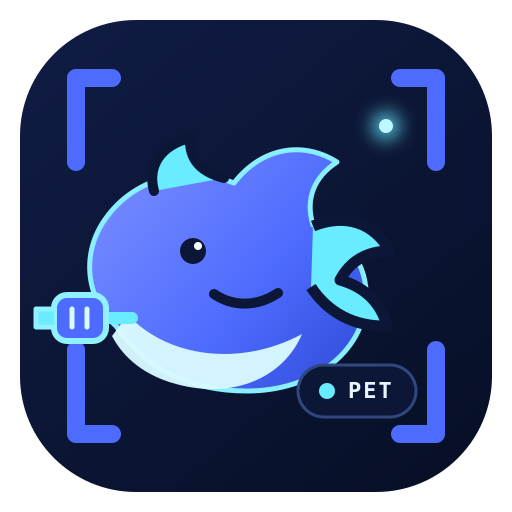
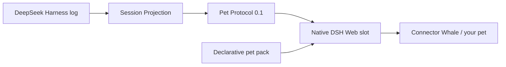

<p align="center">
  <strong>English</strong> · <a href="README.zh-CN.md">中文</a>
</p>

<p align="center">
  
</p>

<h1 align="center">dsh-pet</h1>

<p align="center">
  A native, customizable companion for DeepSeek Harness.
</p>

<p align="center">
  <a href="#quick-start">Quick start</a> ·
  <a href="#pet-protocol-01">Protocol</a> ·
  <a href="#create-your-own-pet">Create a pet</a> ·
  <a href="#install-in-deepseek-harness">Install in DSH</a>
</p>

> Version `0.1` is read-only. It visualizes Harness activity but never sends agent input, invokes tools, or changes task execution.

## Why dsh-pet

An agent's work is usually represented by text and a loading indicator. dsh-pet turns its thinking, tool use, and completion states into a visible companion while keeping runtime behavior separate from a pet's appearance.

Think of it as USB-C for pets: Harness emits a small common event vocabulary, and creators attach declarative pet packs. Whales, cats, pixel robots, and later capability-bearing characters can all speak the same protocol.

## What it does today

- Mounts natively in the DeepSeek Harness Web `conversation.input.overlay` slot.
- Reads current session state through Session Projection, without polling or mutating a session.
- Renders five states: `idle`, `thinking`, `tool`, `success`, and `error`.
- Shows a tool name during tool work, with distinct success and error feedback.
- Supports local click reactions, collapse, and a details panel.
- Replaces the pet through `pet.json` plus local SVG/PNG assets—without changing the protocol or core runtime.
- Reserves `capabilities` for future use; version 0.1 exposes metadata only and has no invocation path.

## Quick start

Requires Node.js 22.19+ and pnpm.

```bash
git clone https://github.com/yusanwen-code/dsh-pet.git
cd dsh-pet
pnpm install
pnpm dev
```

Open the Vite URL. The controls simulate every state without a DeepSeek API key.

```bash
pnpm test
pnpm typecheck
pnpm build
```

Build the native plugin with a custom pet pack by passing its directory; the protocol, core, and UI remain unchanged:

```bash
DSH_PET_PACK=examples/minimal-pet pnpm --filter @dsh-pet/plugin build
```

An invalid manifest falls back to the bundled Connector Whale and surfaces the validation detail in the pet card.

## Install in DeepSeek Harness

Build this checkout, then add the local bundle to a DSH Web profile:

```bash
pnpm build
dsh plugin --profile web add ./packages/dsh-plugin
dsh --profile web --dump-config
dsh --profile web
```

`--dump-config` should list `dsh-pet`. The bundle includes the host entry, browser entry, and `cordis.patch.yml`. To uninstall it:

```bash
dsh plugin --profile web remove @dsh-pet/plugin
```

See the [official DeepSeek Harness packaging guide](https://github.com/deepseek-ai/deepseek-harness/blob/master/docs/user/develop/basic/publish.md) for profile and installation rules.

## Pet Protocol 0.1

The DSH-specific adapter reduces Harness activity to a deliberately small public contract:

```ts
type PetState = 'idle' | 'thinking' | 'tool' | 'success' | 'error'

interface PetEvent {
  version: '0.1'
  state: PetState
  sessionId: string
  timestamp: number
  message?: string
  toolName?: string
  data?: Readonly<Record<string, unknown>>
}
```



Upstream Harness changes stay inside the adapter. Pet packs do not need to change, and a pet rendering failure cannot block Harness work.

## Create your own pet

Copy [`examples/minimal-pet`](examples/minimal-pet), edit `pet.json`, then replace the asset:

```json
{
  "protocolVersion": "0.1",
  "id": "my-pet",
  "name": "My Pet",
  "description": "A tiny declarative pet pack.",
  "author": "you",
  "assets": {
    "idle": { "src": "assets/pet.svg", "alt": "Idle" },
    "thinking": { "src": "assets/pet.svg", "alt": "Thinking" },
    "tool": { "src": "assets/pet.svg", "alt": "Using a tool" },
    "success": { "src": "assets/pet.svg", "alt": "Complete" },
    "error": { "src": "assets/pet.svg", "alt": "Error" }
  },
  "capabilities": [
    { "name": "pet.wave", "description": "Wave hello; declared only in 0.1.", "version": "0.1" }
  ]
}
```

Assets must be package-local relative paths and can only be `.svg` or `.png`. Remote URLs, directory traversal, scripts, and arbitrary CSS are rejected. Supported animation names are `breathe`, `bob`, `pulse`, `shake`, and `celebrate`.

## Repository layout

```text
packages/protocol    # Stable events and Pet Manifest validation
packages/core        # Harness event adapter and isolated subscription service
packages/web         # React pet card and presentation state machine
packages/dsh-plugin  # Native DSH host + browser bundle
pets/deepseek        # Default Connector Whale and five state assets
examples/minimal-pet # Minimal custom-pet example
apps/demo            # Interactive demo with no model required
```

## Roadmap

- `0.1`: Read-only states, replaceable appearance, and a native Web plugin.
- Next: Explicitly permissioned, typed, cancellable, and auditable capability calls.
- Later: Pet-pack tooling, a previewer, and a community directory.

## Brand note

The Connector Whale logo combines a DSH-style frame and node language with a connector tail and an independent `PET` status light. It borrows the ecosystem's DeepSeek-blue and whale-shaped visual cues while intentionally avoiding a direct reuse of the official mark. dsh-pet is an independent community project and is not affiliated with, authorized by, or endorsed by DeepSeek. Follow the [DeepSeek Harness brand guidelines](https://github.com/deepseek-ai/deepseek-harness/blob/master/BRAND_GUIDELINES.md) when using related assets.

## License

[MIT](LICENSE)
