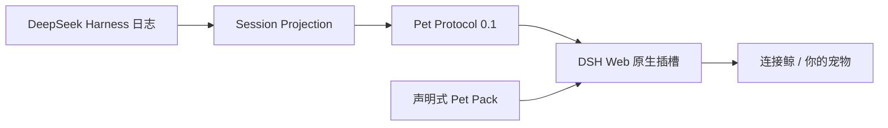

<p align="center">
  <a href="README.md">English</a> · <strong>中文</strong>
</p>

<p align="center">
  
</p>

<h1 align="center">dsh-pet</h1>

<p align="center">
  给 DeepSeek Harness 接上一只有生命感、可替换外观的原生桌面宠物。
</p>

<p align="center">
  <a href="#快速开始">快速开始</a> ·
  <a href="#pet-protocol-01">协议</a> ·
  <a href="#制作自己的宠物">制作宠物</a> ·
  <a href="#原生接入-deepseek-harness">接入 DSH</a>
</p>

> 当前版本：`0.1`。只展示 Harness 状态，不会主动给 Agent 发消息、调用工具或改变任务执行。

## 为什么做 dsh-pet

Agent 在思考、调用工具、完成任务时，界面通常只剩下一些文字和加载动画。dsh-pet 把这些工作状态变成可感知的陪伴，同时把“行为”与“外观”分开。

它更像宠物世界的 USB-C：Harness 只需要输出统一事件，作者只需要提供一个声明式宠物包。以后无论是鲸鱼、猫、像素机器人，还是拥有专属能力的角色，都可以接在同一个协议上。

## 现在能做什么

- 原生挂载到 DeepSeek Harness Web 的 `conversation.input.overlay` 插槽。
- 从 Session Projection 读取真实会话日志，不轮询、不修改会话。
- 展示 `idle`、`thinking`、`tool`、`success`、`error` 五种状态。
- 工具执行时显示工具名；成功和异常状态有独立反馈动画。
- 点击宠物只触发本地互动；可以收起并查看协议与能力声明。
- 用 `pet.json` 和本地 SVG/PNG 替换宠物外观，无需修改核心逻辑。
- 在 `capabilities` 中声明未来能力，但 0.1 没有执行入口。

## 快速开始

需要 Node.js 22.19+ 与 pnpm。

```bash
git clone https://github.com/yusanwen-code/dsh-pet.git
cd dsh-pet
pnpm install
pnpm dev
```

浏览器打开 Vite 给出的地址。左侧按钮可以模拟全部五种状态，不需要 DeepSeek API Key。

```bash
pnpm test
pnpm typecheck
pnpm build
```

构建一个自定义宠物包时，传入它的目录即可；协议、核心和 UI 代码都不用修改：

```bash
DSH_PET_PACK=examples/minimal-pet pnpm --filter @dsh-pet/plugin build
```

无效的 manifest 会在构建后的宠物详情中报告，并自动使用默认“连接鲸”。

## 原生接入 DeepSeek Harness

先在本仓库完成构建，再用 DSH 官方插件命令把本地 bundle 加入 Web profile：

```bash
pnpm build
dsh plugin --profile web add ./packages/dsh-plugin
dsh --profile web --dump-config
dsh --profile web
```

`--dump-config` 中应出现 `dsh-pet`。插件包同时包含宿主入口、浏览器入口和 `cordis.patch.yml`；卸载时使用：

```bash
dsh plugin --profile web remove @dsh-pet/plugin
```

安装和 profile 规则以 [DeepSeek Harness 官方插件文档](https://github.com/deepseek-ai/deepseek-harness/blob/master/docs/user/develop/basic/publish.md) 为准。

## Pet Protocol 0.1

Harness 的内部事件由适配器收敛成一个很小的公共词汇：

```ts
type PetState = 'idle' | 'thinking' | 'tool' | 'success' | 'error'

interface PetEvent {
  version: '0.1'
  state: PetState
  sessionId: string
  timestamp: number
  message?: string
  toolName?: string
  data?: Readonly<Record<string, unknown>>
}
```



协议刻意保持简单：上游 Harness API 变化时只更新适配器，宠物包不需要跟着改。宠物渲染失败也不会阻塞 Harness。

## 制作自己的宠物

复制 [`examples/minimal-pet`](examples/minimal-pet)，修改 `pet.json`，再替换素材：

```json
{
  "protocolVersion": "0.1",
  "id": "my-pet",
  "name": "我的宠物",
  "description": "一个很小的宠物包",
  "author": "you",
  "assets": {
    "idle": { "src": "assets/pet.svg", "alt": "待命" },
    "thinking": { "src": "assets/pet.svg", "alt": "思考" },
    "tool": { "src": "assets/pet.svg", "alt": "使用工具" },
    "success": { "src": "assets/pet.svg", "alt": "完成" },
    "error": { "src": "assets/pet.svg", "alt": "异常" }
  },
  "capabilities": [
    { "name": "pet.wave", "description": "挥手问候（0.1 仅声明）", "version": "0.1" }
  ]
}
```

安全边界：素材必须是包内相对路径，只接受 `.svg` 或 `.png`；不允许远程 URL、父目录穿越、脚本或任意 CSS。可用动画为 `breathe`、`bob`、`pulse`、`shake`、`celebrate`。

## 项目结构

```text
packages/protocol    # 稳定事件与 Pet Manifest 校验
packages/core        # Harness 事件适配与隔离的订阅服务
packages/web         # React 宠物卡片与状态机
packages/dsh-plugin  # DSH 宿主 + 浏览器原生插件 bundle
pets/deepseek        # 默认“连接鲸”与五套状态素材
examples/minimal-pet # 最小自定义宠物示例
apps/demo            # 无需模型即可运行的交互演示
```

## 路线图

- `0.1`：只读状态、可换外观、原生 Web 插件。
- 下一阶段：带权限、类型、取消与审计的能力调用协议。
- 更远阶段：宠物包工具链、预览器与社区目录。

## 品牌说明

主 Logo 以 DSH 的框架/节点语言包住“连接鲸”，并加入连接器尾巴和独立的 `PET` 状态灯。它保留 DeepSeek 蓝色与鲸形的生态识别线索，同时刻意避开官方标志的原样复用。该图形是社区二次创作，本项目与 DeepSeek 官方无隶属、授权或背书关系；使用时请同时遵守 [DeepSeek Harness 品牌素材规范](https://github.com/deepseek-ai/deepseek-harness/blob/master/BRAND_GUIDELINES.zh.md)。DeepSeek 及其标志归各自权利人所有。

## License

[MIT](LICENSE)
